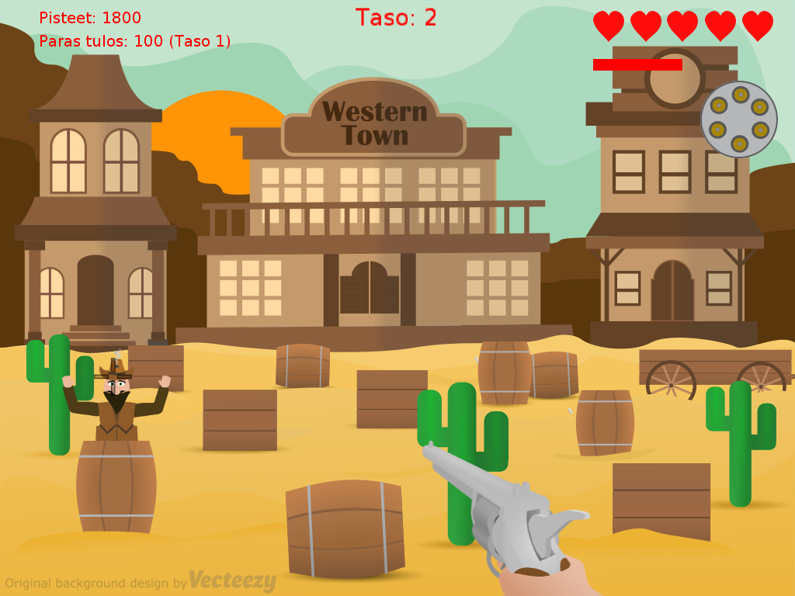

# Six Shooter

 Jyväskylän yliopiston Ohjelmointi 1 -kurssin harjoitustyönä toteutettu peli
 
 Six Shooter on yksinkertainen arcade-henkinen western-teemainen ammuskelupeli. Pelin ideana on hiirellä tähdäten ampua esteiden takaa nousevia vihollisia ja pysyä hengissä mahdollisimman pitkään. Aseena on kuudesti laukeava revolveri. Vasen hiiren näppäin ampuu, oikea näppäin lataa aseen.
 
 Vain päähän tai vartaloon osuneet laukaukset rekisteröidään. Pääosumasta ansaitsee enemmän pisteitä. Voit ansaita myös sattumanvaraisen bonuksen, kuten lisää osumapisteitä tai rajattomat ammukset. Myös bonuksen todennäköisyys on suurempi pääosumassa. 
 
 Eliminoituasi kaikki tason viholliset, alkaa uusi taso jossa viholliset ovat hieman aiempaa nopeampia.

Osa pelin sisällöstä on luotu muokkaamalla muiden tuottamaa avoimella lisenssillä julkaistua materiaalia. Tarkemmat tiedot tekijänoikeuksien haltijoista sekä käytetyistä lisensseistä löydät [täältä](Copyright_notices.md).
 
 Peli vaatii toimiakseen .Net Framework 4.5 tai uudemman.
